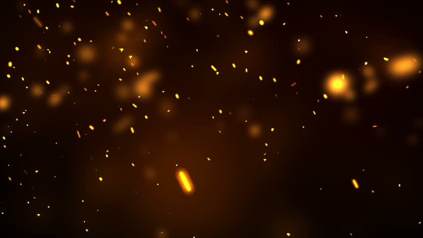

React Particles it's the package that is letting me run those animations in the titles of each blog entry, one of the advantage of this is that it needs 0 minutes of configuration.

To start using it just install it

```js
npm install react-particles-js
```
And import it to your component

```js
import Particles from 'react-particles-js';
 
class App extends Component{
  
    render(){
        return (
            <Particles />
        );
    };
 
}
```
It's just one more component with a few props and configurations that you can edit.

You can go to the demo page, it has a few examples and let's you extract the code, change the colors, type of particles, velocity, etc...

https://rpj.bembi.org/

It's even interactive, if you click in the area with the particles they will run of you

This package is based in particles.js a Javascript library with the same idea, react-particles-js it's an adapatiton to TypeScript

Have fun!

